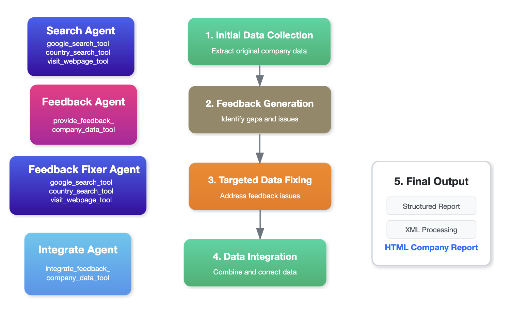
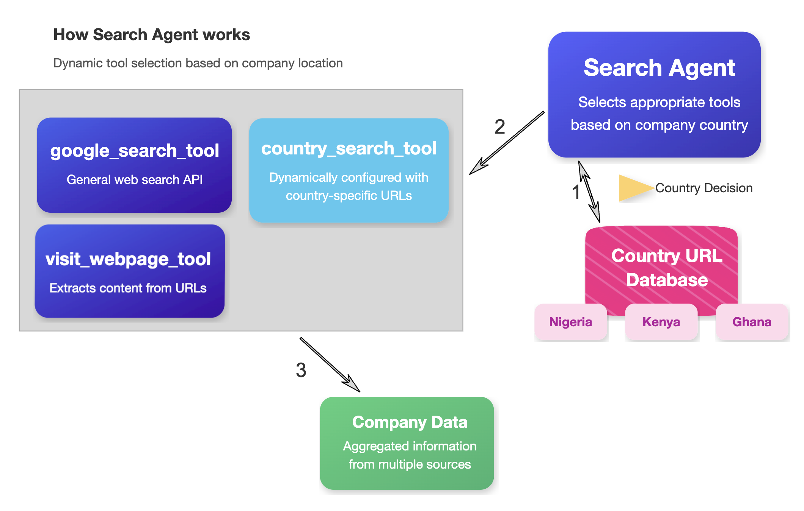

# Company Data Research Agentic System

## System Overview

The Company Data Research Agentic System is designed to discover, validate, and compile comprehensive information about companies by leveraging multiple specialized agents working in coordination. The system processes company information through a series of steps with built-in feedback mechanisms to ensure accuracy and completeness of the final company profiles.

## Architecture Components

### 1. Tools Database

A centralized repository containing various data sources and tools that agents can access. This database is organized by country, allowing agents to select appropriate tools based on the company's geographic location.

#### Global Tools
Global tools refer to search engines and data sources that provide information applicable across multiple countries or regions, offering broad data discovery capabilities.

*The following are representative examples, not an exhaustive list:*
- **Google Search**: General web search for discovering company information from multiple sources
- **Visit Webpage Tool**: Extracts detailed information from identified websites

#### Country-Specific Tools
Country-specific tools are databases, registries, and sources that provide localized information relevant to a particular nation, offering deeper contextual data not available in global sources.

*The following are representative examples, not an exhaustive list:*
- **Nigeria Corporate Affairs Commission Database**: Official business registry information for Nigerian companies
- **Kenya Business Registration Service**: Registry data for Kenyan business entities
- **Ghana Registrar-General's Department Database**: Official company registration information in Ghana

### 2. Search Agent

This agent focuses on gathering company information from multiple sources:

- **Primary Function**: Collects, extracts, and compiles company data
- **Tools Used**:
  - google_search_tool: Finds company websites, directories, and public information
  - visit_webpage_tool: Scrapes and analyzes content from identified websites
  - country_search_tool: Accesses country-specific databases and registries
- **Tool Selection Process**:
  - Dynamically selects appropriate country-specific tools based on company location
  - Accesses a database of country-specific URLs to configure search parameters
  - Always uses global tools regardless of company location
- **Information Types Gathered**:
  - Company registration details
  - Contact information and physical locations
  - Leadership and ownership structure
  - Products and services
  - Business relationships and partnerships
- **Output**: Comprehensive initial company profile with source attributions

### 3. Feedback Agent

This agent performs critical assessment of the collected company data:

- **Primary Function**: Analyzes initial company data to identify gaps, inconsistencies, and areas for improvement
- **Tool Used**:
  - provide_feedback_company_data_tool: Specialized tool for analyzing company profiles
- **Key Characteristic**: This agent does NOT provide answers or solutions, but rather raises questions and identifies information needs
- **Analysis Performed**:
  - Evaluates completeness of essential company information
  - Identifies contradictory data points across sources
  - Flags potentially outdated information
  - Detects missing critical business details
  - Assesses overall profile quality and reliability
- **Output**: Structured feedback document with specific questions and information gaps requiring further investigation

### 4. Feedback Fixer Agent

This agent addresses the questions and issues raised by the Feedback Agent:

- **Primary Function**: Conducts targeted research to specifically address identified gaps and answer raised questions
- **Tools Used**:
  - google_search_tool: Performs focused searches for missing information
  - visit_webpage_tool: Extracts specific data from targeted websites
  - country_search_tool: Queries specialized databases for precise details
- **Processing Performed**:
  - Executes specific search queries based on feedback questions
  - Focuses research efforts on identified information gaps
  - Prioritizes critical missing information
  - Resolves inconsistencies by finding authoritative sources
  - Documents all findings with clear source attribution
- **Output**: Focused research results specifically addressing feedback issues

### 5. Integrate Agent

This agent synthesizes original data with enhancements:

- **Primary Function**: Incorporates targeted fixes and additional research into the original company profile
- **Tool Used**:
  - integrate_feedback_company_data_tool: Specialized tool for merging and structuring company data
- **Processing Performed**:
  - Merges validated information with original data
  - Resolves conflicting information with preference for newest, most reliable sources
  - Structures information according to standardized formats
  - Maintains source attributions for all data points
  - Creates a cohesive, unified company profile
- **Output**: Enhanced, validated company profile with complete information

### 6. Report Generation Tool

This component transforms the integrated data into structured outputs:

- **Primary Function**: Converts raw company data into standardized, readable formats
- **Processes Performed**:
  - Applies consistent formatting to all company information
  - Organizes data into logical sections
  - Generates machine-readable XML structure
  - Creates human-readable HTML reports
  - Ensures all data points are properly attributed
- **Output**: Finalized company report in multiple formats (Structured Report, XML, HTML)

## Workflow

1. **Initial Data Collection**: The **Search Agent** collects original company data using both global and country-specific tools
2. **Feedback Generation**: The **Feedback Agent** critically assesses the original data and identifies gaps and issues
3. **Targeted Data Fixing**: The **Feedback Fixer Agent** conducts targeted research addressing specific feedback issues
4. **Data Integration**: The **Integrate Agent** combines original data with newly discovered information
5. **Final Output**: The **Report Generation Tool** produces a structured company report using standardized templates

Throughout this process, a caching mechanism stores results at each step to improve efficiency for repeated runs with the same company.

## Implementation Considerations

- **Source Reliability Assessment**: Mechanisms to evaluate the credibility of different information sources
- **Information Prioritization**: Framework to distinguish between critical and secondary company information
- **Data Standardization**: Methods for normalizing data formats across different sources
- **Caching System**: Efficient storage of intermediate results to avoid redundant processing
- **Country Detection**: Accurate identification of company country to select appropriate tools
- **Language Processing**: Handling of language barriers for international companies
- **Human Oversight**: Points in the workflow where human review may be valuable

## Future Enhancements

- Integration with financial data providers for company performance information
- Real-time monitoring of company changes (leadership, locations, services)
- Automated periodic updates to maintain data freshness
- Industry-specific data collection modules for specialized information
- Sentiment analysis of company reputation from social media and news sources
- Interactive dashboard for company data visualization
- API integration with CRM and business intelligence systems