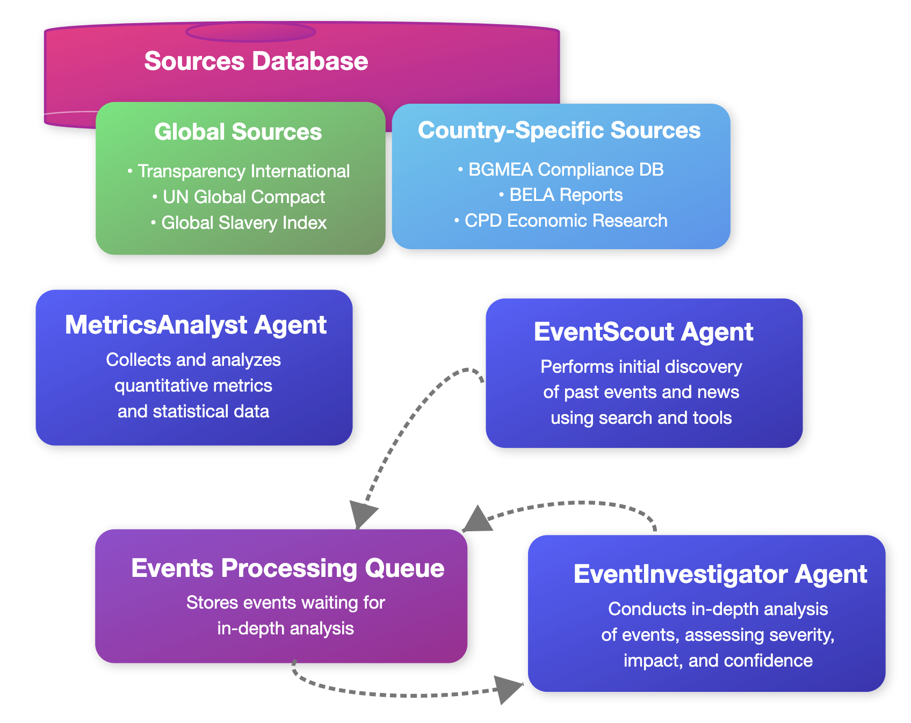

# Supplier Risk Assessment Agentic System

## System Overview

The Supplier Risk Assessment Agentic System is designed to discover, analyze, and evaluate risks associated with suppliers by leveraging multiple specialized agents working in coordination. The system processes both quantitative metrics and qualitative events to provide comprehensive risk profiles.

## Data Categories

Before detailing the agent architecture, it's important to understand that the system processes two fundamentally different types of data:

### 1. Metrics and Statistical Data
This category consists of quantitative information that provides standardized measurements of risk factors:
- **Definition**: Numerical indicators, ratings, and statistical measures that quantify aspects of supplier risk
- **Characteristics**:
  - Typically structured and formatted consistently
  - Often updated on regular schedules (monthly, quarterly, annually)
  - Can be compared across different time periods and suppliers
  - Usually comes from established monitoring bodies and official sources
- **Examples**:
  - Corruption perception scores by country
  - Environmental compliance ratings
  - Labor standards adherence percentages
  - Financial stability indicators
  - Safety incident frequency rates
  - Regulatory compliance percentages

### 2. Past Events and News
This category encompasses specific incidents, news reports, and qualitative information about suppliers:
- **Definition**: Discrete occurrences, media coverage, and reports of specific incidents related to a supplier
- **Characteristics**:
  - Usually unstructured text data requiring interpretation
  - Irregular and unpredictable occurrence
  - Requires context evaluation and source credibility assessment
  - Often needs natural language processing to extract relevant information
- **Examples**:
  - Environmental disasters (oil spills, chemical leaks)
  - Labor disputes (strikes, walkouts)
  - Ethical violations (child labor allegations, worker mistreatment)
  - Legal proceedings (lawsuits, settlements)
  - Media exposés on supplier practices
  - Regulatory violations and associated penalties

The system uses different specialized agents to process these distinct data types, ensuring appropriate handling of both structured metrics and unstructured event information.

## Architecture Components

### 1. Tools Database

A centralized repository containing various data sources and tools that agents can access. This database is manually curated by human experts who already possess the necessary domain knowledge to select appropriate sources. In the future, the system may include an agent that suggests new data sources to augment this knowledge base.

#### Global Tools
Global tools refer to data sources, indices, and databases that provide information applicable across multiple countries or regions, offering standardized metrics for international comparison and risk assessment.

*The following are representative examples, not an exhaustive list:*
- **Transparency International's Corruption Perceptions Index**: Annual rankings and scores for countries based on perceived corruption levels
- **UN Global Compact Database**: Information on companies' commitments to sustainability, human rights, labor, environment, and anti-corruption
- **Global Slavery Index**: Country-level data on modern slavery risks for supply chain human rights due diligence

#### Country-Specific Tools
Country-specific tools are databases, reports, and resources that provide localized information relevant to a particular nation or region, offering deeper contextual data not available in global sources.

*The following are representative examples for Bangladesh, not an exhaustive list:*
- **Bangladesh Garment Manufacturers and Exporters Association (BGMEA) Compliance Database**: Industry-specific database tracking factory compliance with safety and labor standards
- **Bangladesh Environmental Lawyers Association (BELA) Reports**: Data on environmental compliance and violations by industrial facilities
- **Centre for Policy Dialogue (CPD) Economic Research**: Economic analysis and stability metrics specific to Bangladesh's business environment

### 2. MetricsAnalyst Agent

This agent focuses on processing quantitative and statistical data:

- **Primary Function**: Collects, analyzes, and interprets metrics and statistical indicators
- **Data Sources**: Leverages global indices and country-specific databases 
- **Outputs**: Standardized risk scores across multiple categories
- **Analysis Capabilities**: Identifies trends, anomalies, and statistical patterns

### 3. EventScout Agent

This agent performs initial discovery of past events and news:

- **Primary Function**: Broad discovery of potential risk events across numerous sources
- **Tools Used**:
  - GoogleSearch: Finds news articles, reports, and public information
  - VisitWebpage: Scrapes and analyzes content from identified websites
  - GlobalRiskFetchTool: Pulls standardized global risk information
  - CountrySpecificRiskFetch: Gathers localized risk data
- **Event Types Detected**:
  - Environmental incidents (oil spills, pollution violations)
  - Labor issues (strikes, worker mistreatment, child labor allegations)
  - Regulatory compliance issues (violations, penalties)
  - Ethical concerns (corruption allegations, bribery)
- **Output**: Posts discovered events with source URLs to the Events Processing Queue

### 4. Events Processing Queue

A central coordination mechanism for managing discovered events:

- **Primary Function**: Stores and prioritizes events waiting for in-depth analysis
- **Benefits**:
  - Decouples discovery and analysis processes
  - Enables asynchronous workflow
  - Supports system scalability
  - Creates natural checkpoints for human review if needed
- **Operation**: Functions as a FIFO queue with priority capabilities

### 5. EventInvestigator Agent

This agent performs comprehensive analysis on individual events:

- **Primary Function**: Conducts in-depth research and assessment of events pulled from the queue
- **Analysis Performed**:
  - Verifies authenticity from multiple sources and eliminates potential fake news
  - Assesses severity using multiple corroborating sources
  - Evaluates business impact specific to the supply chain
  - Determines confidence level of findings
  - Categorizes incidents by type
  - Documents causality and responsible parties
  - Estimates financial and reputational impact
- **Recursive Capability**: May push new discovery tasks back to the queue when further investigation is needed

## Workflow

1. The **MetricsAnalyst Agent** collects and analyzes metrics from the statisticaldata sources fetched from the Sources Database
2. The **EventScout Agent** scans for potential risk events from various sources (including news, social media, and plain internet search)
3. Discovered events are posted to the **Events Processing Queue**
4. The **EventInvestigator Agent** pulls events from the queue for in-depth analysis
5. If additional information is needed, the EventInvestigator may send new discovery tasks back to the queue
6. Final risk assessments incorporate both metrics and analyzed events

## Implementation Considerations

- **Information Verification**: Mechanisms to handle potential inaccuracies in news reports
- **Temporal Analysis**: How far back in time to search for historical incidents
- **Risk Prioritization**: Framework to distinguish between major and minor incidents
- **Language Processing**: Handling of language barriers for international suppliers
- **Integration**: Method for combining metrics and event data into a cohesive risk profile
- **Human Oversight**: Points in the workflow where human review may be valuable
- **Scaling**: Ability to add more validator agents when the queue grows

## Future Enhancements

- Integration with supplier financial data
- Real-time monitoring of social media for emerging risks
- Predictive risk modeling based on historical patterns
- Interactive dashboard for risk visualization
- API integration with procurement systems